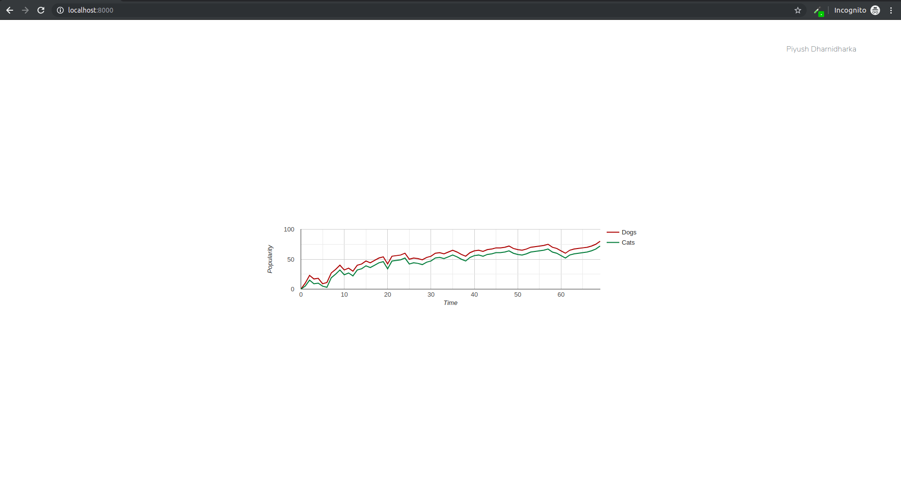

This is a test designed to check if you are comfortable with using Laravel and can create a simple chart from the data provided.

Requirements: You need to have composer and laravel installed in your system. The installation documents are here: https://laravel.com/docs/5.8

Steps to get the project running:
1. Clone the project and cd into it
2. Run the command `composer install`
3. Run the command `php artisan serve`

You should now get the message : Laravel development server started: <http://127.0.0.1:8000>

I have removed the .env file from .gitignore, so if your setup is failing, this is not a probable cause.

Once you are able to get the localhost running, go to your browser at localhost:8000. You should see a page with the message "Your chart should appear here". Once you get this, your setup is successful.

Now, go to the file resources/views/test.blade.php
Remove the line "Your chart should appear here". And add the graph from this jsfiddle: https://jsfiddle.net/wvtrg64y/

If you are able to show the same graph when you click localhost:8000, congratulations.

A screenshot of the correct solution is : 
